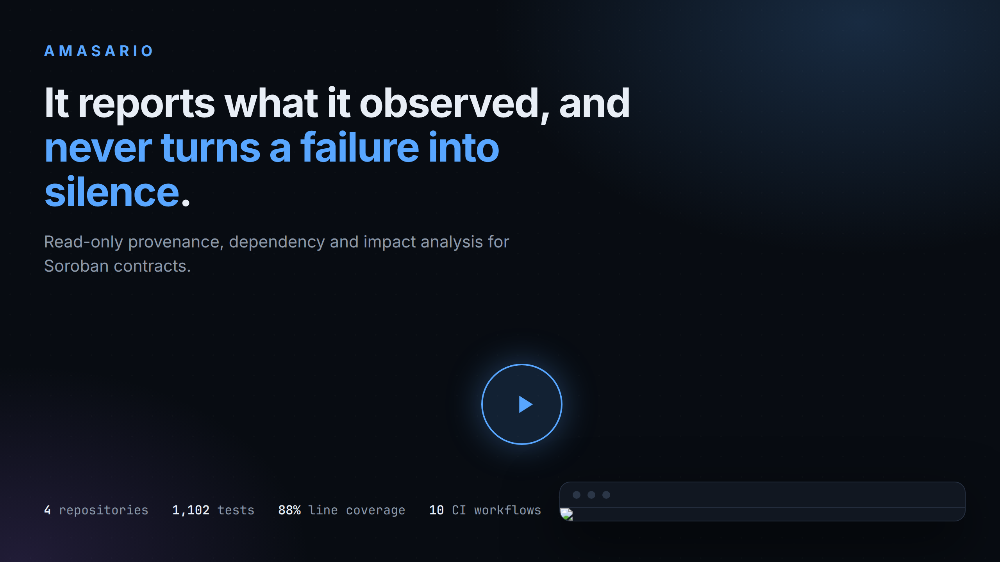

# AMASARIO — Explorer

[](https://github.com/Amasario-Soroban-Click/amasario-explorer/actions/workflows/ci.yml)
[](https://github.com/Amasario-Soroban-Click/amasario-explorer/actions/workflows/deploy.yml)
[](LICENSE)
[](https://amasario-explorer.vercel.app/pitch/amasario-pitch-v2.mp4)

**A browser over the [Amasario provenance engine](https://github.com/Amasario-Soroban-Click/amasario-provenance-engine)'s own documents.**

[](https://amasario-explorer.vercel.app/pitch/amasario-pitch-v2.mp4)

The recording is a production about the project — what the engine observes, what it
refuses to claim, the four layers it is built from, and the Testnet deployment of the
reference contract. It is not one of the documents this browser renders, and the section on
the homepage says so too, because a page whose whole claim is that nothing is invented
should not leave a reader to guess which panel is evidence and which is a recording.

This repository is the **presentation layer** of Amasario. It performs no analysis, holds
no keys, contacts no network, and computes nothing about any contract. It reads documents
the engine already produced and draws them.

## What it shows

| View | What it is |
| --- | --- |
| **Graphs** | Five committed `amasario graph` documents, drawn with a deterministic layout and listed underneath with each relationship's confidence, observation status, basis and evidence count. |
| **Snapshots** | One contract captured at two boundaries, and the relationships that differ — with the module digests beside them, because a changed graph over an unchanged module is a different claim from a changed contract. |
| **Reference contract** | The two Soroban contracts this project builds from source, their recorded digests and toolchains, and the cross-contract call they were constructed to produce — both halves deployed to Testnet. |
| **Documentation** | The engine's own pages, rendered from their Markdown sources, with links that leave the browser pointing at the engine repository. |

## Where the data comes from

Nothing is fetched at runtime. Every file under `public/data/` and `public/docs/` is a
byte-for-byte copy of a file in the engine, taken at a commit recorded in
`public/data/manifest.json` — and every one of those digests is re-checked on every CI run
by `scripts/verify-manifest.mjs`.

That check is the point rather than a nicety. A viewer is the last place a viewer's claims
can go unchecked, and "this is the engine's output" is exactly the kind of caption that
stays true until it doesn't. The check fails if a copied file is edited in place, if one is
dropped, or if one appears that the manifest does not list — because a missing fixture and
an altered one both produce the same symptom, a page that quietly shows the wrong thing.

To re-vendor from a chosen engine checkout:

```bash
node scripts/vendor.mjs /path/to/amasario-provenance-engine
```

## The walkthrough

Five minutes, narrated, hosted by this deployment rather than by a third party — pressing
play contacts no host outside the project, which is the same rule the rest of the site
follows. The poster is `public/pitch/amasario-pitch-thumbnail.png` and the file is
`public/pitch/amasario-pitch-v2.mp4`; both ship in the build, and `vercel.json` serves them
immutable because the filename carries a version.

The version number is the point. `v2` is a re-render of `v1` rather than an edit to it,
because shot durations are derived from the narration — so changing a line of the script
re-cuts the whole film. What `v2` adds is a shot of the deployed reference contract being
observed on Testnet: the engine reading the callee's own event to name the caller that
entered it, and then declining to answer the same question asked of the caller, because
that direction left no trace to read. Both deployed modules hash to the fixtures committed
in the engine, and the difference between `v1` and `v2` is recorded in the engine's
`docs/pitch-video.md`.

The video is a recording of the project and not a source of truth about it. Where the two
disagree, the documents under `public/data/`, the checks in `ci.yml` and this README are
what the project claims, and the video is out of date.

## What this is not

This is not a security scanner, and no output here is a security opinion. The vocabulary
is deliberately narrow and the viewer keeps it that way:

- `VERIFIED` means *the stated evidence is consistent with the stated claim*. It describes
  evidence completeness, never the trustworthiness of a contract.
- An address is not an identity. A Soroban address survives an upgrade unchanged.
- A relationship that does not state its basis is rendered as "basis unstated" rather than
  as a guess at what the basis was.
- A failed read is reported as a failed read. An empty graph is drawn as an empty graph,
  never as the result of a read that did not happen.

The explorer does not add a word to any of that. Where the engine's document declines to
say something, the page shows that it declined.

## Building

```bash
npm ci
npm run typecheck   # strict TypeScript, no emit
npm test            # vitest, over the layout, diff, formatting and link rewriting
npm run build       # emits dist/
npm run preview     # serves dist/ locally
npm run verify:manifest
```

The layout and the diff are pure functions in `src/graph/layout.ts` and `src/diff.ts`, and
they are the two things the tests are mostly about. Everything the site asserts about a
document is decided there; the rest of the code turns decisions into elements. A test that
checked a node's position by reading it back out of the DOM would be testing the DOM, and
a layout that rearranged itself between two renders would make two screenshots of the same
graph incomparable — which is why there is no force simulation anywhere in the tree.

## Deployment

**Live at [amasario-explorer.vercel.app](https://amasario-explorer.vercel.app).**

A static site on Vercel. `vercel.json` sets the build command, the output directory and the
response headers; there is no server, no function and no environment variable, because
there is nothing a server would add to a site that reads committed files.

`.github/workflows/deploy.yml` deploys on every push to `main`. It runs the same
`typecheck`, `test` and manifest verification that `ci.yml` runs before it publishes
anything, so a commit whose data does not match the manifest cannot reach production - and
after deploying it fetches the deployment once and requires a 200 with the expected page,
because a deploy step that uploads and never requests the result cannot tell a working site
from a static 404.

## Licence

Apache-2.0. See [`LICENSE`](LICENSE).
